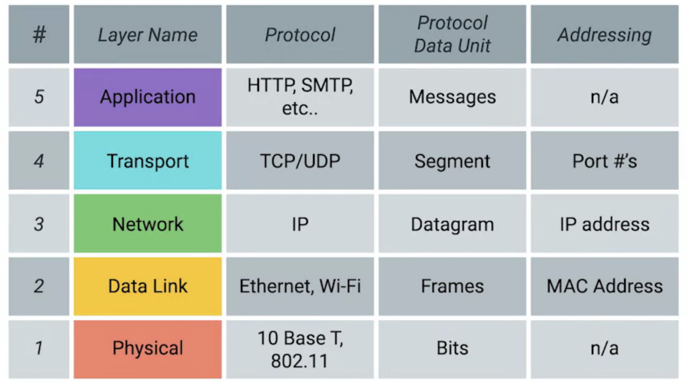
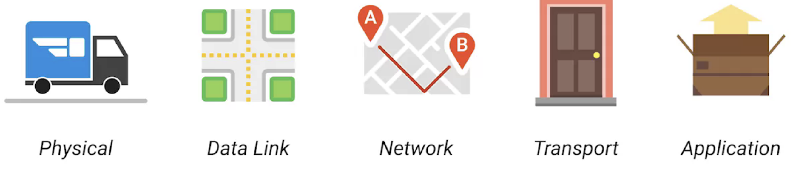
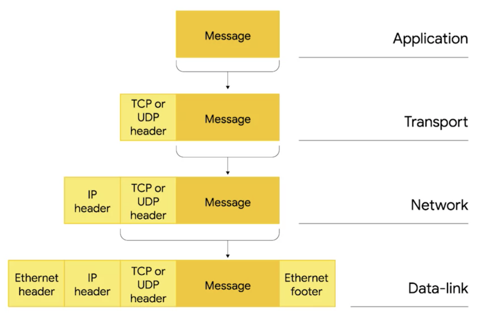
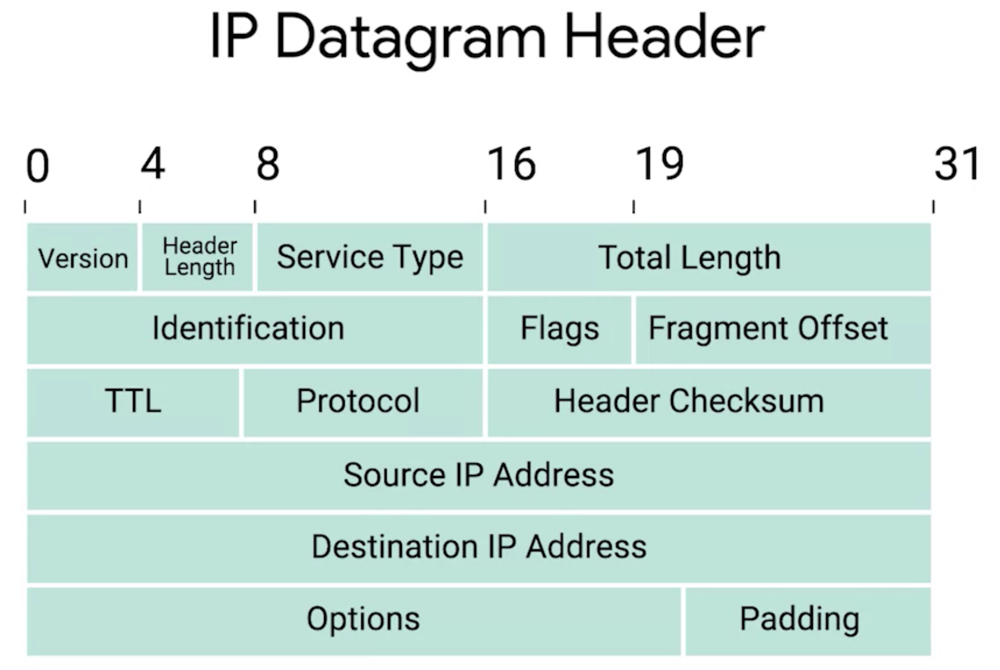
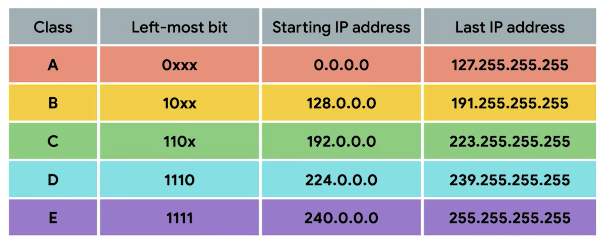
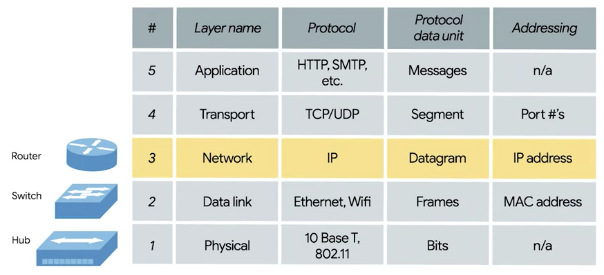

# Layers

- **Physical**: Devices that interconnect computers. Cabling, connections, sending signals.
- **Data Link**: Network interface or network access layer. First protocol. Data to nodes in the same layer or links.
- **Network**: Internet layer. Communication between networks through routers. Data across a collection of networks. 
Getting data from one node to another.
- **Transport**: Which client and server are supposed to get the data.
- **Application**  
  

Encapsulation

# Devices (nodes)
- **Switch**: between a LAN. Inspected Ethernet data.
- **Router**: between independent networks. Inspects Internet data.

# Workflow
1. `nmap` port scan to check open ports
2. `metasploit` enumeration to check SMTP: `smtp_version` and `smtp_enum`
3. now we have a SSH port open, a user account name, type of SMTP server and OS.
4. Use this information to try and [`bruteforce`](brute_force.py) the password of the SSH login for our user using Hydra.